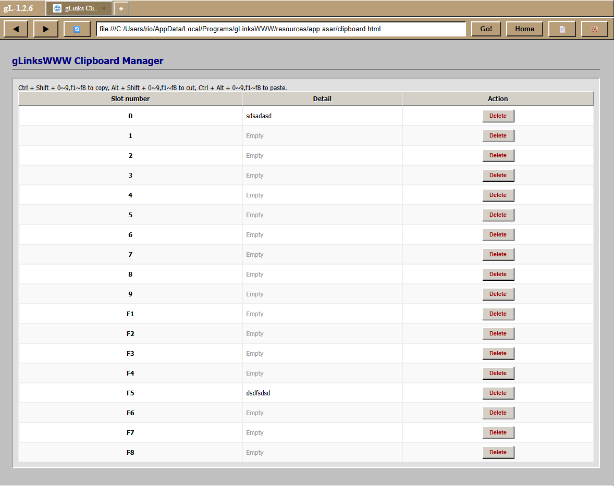
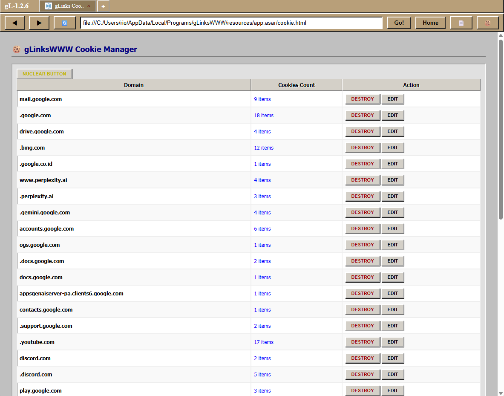

About gLinksWWW Browser 2.0.0 (PyQt6 Webengine)
Developed by: Rio Burhan (riobhn19@gmail.com)

gLinksWWW is a privacy-focused, high-productivity web browser designed for power users who demand speed, control, and absolute privacy.

<strong>1. Innovative Multi-Slot Clipboard (18 slot) and the clipboard manager</strong>

Break free from the single-item clipboard limit. gLinksWWW features a 9-Slot Multi-Copy & Paste system.

18 Concurrent Slots: Store up to 9 different text snippets or links simultaneously.

Powerful Hotkeys: * Ctrl + Shift + 0 ~ 9,f1 ~ f8 : Copy to the specific slot.

Alt + Shift + 0 ~ 9,f1 ~ f8 : Cut to the specific slot.

Ctrl + Alt + 0 ~ 9,f1 ~ f8 : Paste from the specific slot.

you can also view and manage what you copy/cut in the clipboard manager!

Note: Make sure to remember your slot numbers! (e.g., if you copy to Slot 2, you must paste from Slot 2).

**2. Instant Search Engine Switcher** 

Experience total freedom of search. Switch between the world’s most powerful search engines with a single click directly from the interface:

AI-Powered: Perplexity

Global Standards: Google, Bing, Yahoo

Privacy-Centric: Startpage

Region-Specific: Yandex, and more.

**3. Absolute Privacy: No History Policy** 

Your browsing is your business. gLinksWWW is built with a Zero-Footprint architecture:

No History Stored: Navigation history is never saved to the local disk.

Clean Exit: Once you close the session, all your tracks are instantly gone.

**4. Per-Website Cookie Management** 

Take granular control over your digital identity:

Isolation: Manage, destroy, and edit cookies for specific websites without affecting others.

Cookie Manager: Access the dedicated manager via the cookie icon to monitor and control site data.

**5. Retro-Modern UI & Multi-Tab System** 
Combining the aesthetics of the classic web with modern high-speed performance:

Multi-Tab Navigation: High-speed tab system (supporting up to 7 tabs).

Unique Aesthetic: Tan/Brown Retro UI inspired by early computing history.

Cross-Platform: Available for Windows, Linux (AppImage/DEB), and MacOS
